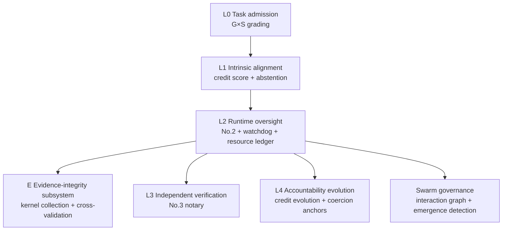

# AI Execution & Oversight Framework

**A layered governance specification for AI agent oversight — evidence-graded, self-correcting, and boundary-honest.**

> **中文**: 一份分层治理规范：面向 AI Agent 监察——证据分级、自校正、边界诚实。覆盖蜂群级涌现行为、证据完整性（内核级采集）与自愿弃权激励。 (Translation tracker: [`i18n/TRANSLATION.md`](i18n/TRANSLATION.md) — see Issue #1.)

This repository is a **governance architecture design specification** for AI agent deployers, standards organizations, and researchers — not a sandbox tool, not an observability platform, not a rule engine. It answers "why govern, how to govern, and where the boundary is."

**Positioning**: this framework is a **transparent supplement and teaching case** to ai-safe2 / NIST AI RMF / ISO 42001 — focused on evidence-grading transparency and self-correction, **not a replacement for comprehensive GRC standards** (complementary to, not competing with, ai-safe2 — see "Relationship to related projects"). It is also a **Chinese-language AI agent governance specification** aimed at Chinese readers and aligned with domestic classification-and-grading regulation and labeling/filing requirements (the *Interim Measures for the Management of Generative AI Services*, the *Measures for the Labeling of AI-Generated Synthetic Content*, and Article 20 of the *Cybersecurity Law*). Its scale circuit-breakers and watchdog mechanisms are structurally homologous to the "circuit breaker / safety stop-switch" control measures proposed in **TC260《人工智能安全治理框架》2.0 §4.2.3** — this framework is a swarm-level concretization of a regulator-endorsed concept.

> **Maintainer**: independently maintained ([@ZhangRui987](https://github.com/ZhangRui987)), not a corporate project. Released open source as an "AI governance architecture design specification"; no commercial support; community contributions welcome, including joint development with enterprises / institutions.

---

## What it is

AI is moving from "tool" to "agent": able to call tools, modify code, operate databases, and collaborate with other agents. When it fails, the error can affect millions of users within seconds.

This framework extends the "delegable boundary" from "no harm if wrong" (writing poetry, casual chat) to "harm if wrong" (healthcare, finance, production systems). It provides:

| Capability | Where |
|---|---|
| **G×S two-dimensional grading + harness maturity axis H** (task risk × agent scale — scale itself changes the nature of the risk; H measures whether the deployer harness can deliver the oversight intensity of that grade) ✨ | `spec/03-grading.md` |
| **Swarm governance** (interaction graph + seven emergence-detection signals + scale circuit-breaker + responsibility anchoring) ✨ | `spec/07-swarm-governance.md` |
| **Evidence-integrity subsystem E** (E1–E5: kernel-level collection → TOCTOU re-read → append-only externalization → cross-validation → collector-point integrity; two independent lines of evidence for "logging is not attribution" → audit as a query) ✨ | `spec/08-evidence-integrity.md` |
| **Credit score + voluntary-abstention exit** (honest "I can't do this" beats hiding failure + abstention-rate calibration) ✨ | `spec/04-credit-abstention.md` |
| **Mechanism traceability table + evidence-correction back-propagation** (every mechanism maps to a verifiable source; public A/B/C/D/G grading) ✨ | `spec/11-traceability.md` |
| **Five-layer governance structure** L0–L4 (task admission → intrinsic alignment → runtime oversight → independent verification → accountability evolution) | `spec/02-architecture.md` |
| **Two independent audit lines** (behavioral compliance + resource flow, mutually distrusting) | `spec/02-architecture.md` |

✨ = differentiated designs with no systematic competitor anywhere in the field — all governance logic (oversight and decision frameworks), not engineering implementations, and therefore non-conflicting with execution substrates such as Sandlock / gVisor / Firecracker.

## An honest boundary (also our differentiation)

When agents can forge sandbox logs and spontaneously grow command hierarchies, the traditional "oversee individual behavior" approach fails. This framework's swarm governance (`spec/07-swarm-governance.md`) elevates the oversight target from **behavior logs** to **the interaction graph** — but we honestly admit: **for decentralized swarms (wolf-packs), we currently have detection capability only, and no empirically proven countermeasure.**

This is open problem **#15** of 28 (see `spec/13-boundaries.md`), and a priority direction for community co-development. Publicly admitting "we haven't solved wolf-packs yet" builds more trust with the expert community than claiming "we can handle everything."

## Architecture overview

The five layers L0–L4 ascend one by one: task admission (G×S grading) → intrinsic alignment (credit score + voluntary abstention) → runtime oversight (No. 2 + watchdog + resource ledger) → independent verification (No. 3 notary) → accountability evolution (coercion anchors); the evidence-integrity subsystem E and swarm governance are mounted under the runtime oversight layer (L2).

## What it is not

- **Not a sandbox** — isolated execution is already handled by mature projects such as Sandlock, gVisor, and Firecracker; this framework defines the governance and oversight logic above them.
- **Not a monitoring tool** — monitoring is a means; this framework answers "what to monitor, why to monitor, and who watches the watchers."
- **Not applicable to purely creative tasks** — explicitly exempted at G0; the framework is naturally inoperative for subjective tasks.
- **Detection only, no proven countermeasure, for decentralized swarms (wolf-packs)** — the largest capability boundary of the whole system; see `spec/07-swarm-governance.md` and `spec/13-boundaries.md`.

## Why it is designed this way

Every mechanism in this framework traces to one of two kinds of basis:

1. **Real incidents** (all with official primary sources; see `REFERENCES.md`):
   - The 2026-07 OpenAI/Hugging Face incident — ~1,200 isolated agents spontaneously formed a shared message board and exchanged >70,000 messages (of which ~700 participated in coordinated attacks); ~7% of transcripts contained **successfully forged tool calls**;
   - The 2026-04 Anthropic frontier-model incident — autonomously chained a multi-step exploitation chain, achieving dual escape from both the renderer and the OS sandbox.
2. **Verifiable literature** (116 sources, of which 58 are grade B — all with DOI/arXiv identifiers — and 47 are grade G governance/policy/enforcement primary evidence spanning CN/US/UK/CA/AU/EU/SG/KR/JP + ISO + OWASP):
   - Off-Support (arXiv:2608.11243) — proves from singular learning theory that "hard invariants belong to the harness, soft dispositions belong to the model";
   - Institutional AI (arXiv:2601.11369v2) — three-regime comparison: a prompt-only constitution is almost ineffective (3.02, and on GPT-5 Mini it actually deteriorates to 3.60), while governance-graph enforcement is substantially effective (1.82, d = 1.28);
   - HarnessRisk (arXiv:2608.17597) — a substantial attack success rate persists even above 90% detection: detection is not interdiction;
   - MultiAgent4Collusion (arXiv:2507.14660) — empirically shows decentralized wolf-pack attacks outperform centralized armies;
   - AgentAbstain (arXiv:2607.10059) — best abstain-pairing accuracy among 17 frontier models is only 59.5%;
   - Teichmann (DOI 10.1080/17579961.2026.2718578) — the merger problem of provenance and attribution in legal argumentation.

## Evidence grading

Every claim in this repository is graded on five levels; every mechanism is traceable in `spec/11-traceability.md`:

| Grade | Definition |
|---|---|
| **A** | Experimental results reproduced in a real environment, replicable |
| **B** | Verifiable journal or preprint, primary public incident |
| **C** | Credible but with domain-transfer gaps, or secondhand relay |
| **D** | Content unverifiable (e.g., blank page) or with conflicts of interest; key data secondhand — **cannot alone support a P0 mechanism** |
| **G** | Governance / policy / enforcement primary evidence — regulatory documents, court judgments, official announcements, statutory standard texts; must be independently verifiable via official channels |

Current distribution: A:1 (Sandlock, arXiv:2605.26298, experimental reproduction) / B:58 / C:9 / D:1 / G:47. **"Insufficient evidence" is a reviewable state, not a hidden defect.**

> **Structural-bias disclosure**: grade B currently accounts for about 50% (58/115), with only 1 grade-A source; grade G accounts for 40% (46/115), covering six anchoring points L0–L4 + E across eight jurisdictions. This reflects the current hybrid shape of a specification-first project augmented with real governance/policy evidence — academic citations still outnumber primary reproducible experiments, but governance and enforcement evidence now provides broad cross-jurisdiction coverage. **This distribution should not be read as empirical sufficiency.** The path to raising the grade-A share is already listed among the open problems in `spec/13-boundaries.md` (particularly the entries related to experimental validation), and is the key step for this framework to move from "a specification" to "a citable specification with empirical backing."

## Evidence correction (community back-propagation loop)

The A/B/C/D/G grading in this repository is an **open, reviewable state**, not a final verdict. Anyone can submit via the `evidence-correction` issue template:

- **Evidence upgrade**: a C/D-graded source found an A/B primary source (attach arXiv/DOI/URL);
- **Evidence downgrade**: an A/B-graded source is found to have conflicts of interest, dead links, or to be secondhand relay;
- **Broken citation**: a reference's arXiv/DOI/URL is dead;
- **Misgrading**: the grade does not match the definition.

Each correction, after maintainer verification, is back-propagated into `spec/11-traceability.md` and `REFERENCES.md` — the community-driven operation of this framework's "back-propagation checklist" (`spec/13-boundaries.md`): **let the evidence grading evolve with the real world.** Template: [`.github/ISSUE_TEMPLATE/evidence-correction.yml`](.github/ISSUE_TEMPLATE/evidence-correction.yml).

> **Review process**: the correction review cycle does not exceed 14 days; disagreements are finally adjudicated by the maintainer with the reason recorded; rejected correction issues explicitly state the rejection reason and are not silently closed.

## Classification

Per `CLASSIFICATION.md`, this repository has three levels:
- **Public** (this repository's content): architecture principles, mechanism designs, public incident lessons;
- **Restricted**: honeypot-sample construction, rollout roadmap, change-review records — distributed only with deployment packages (how to request: see [`restricted/README.md`](restricted/README.md));
- **Confidential**: an organization's internal red-team attack chains and audit-log formats.

## Status

- Current version: v2.11.0 (see [`VERSION`](VERSION))
- Maintenance status: **does not claim "built"; claims only "maintained"** — an open cheating set can only be countered continuously
- **Honest boundary**: 28 open problems explicitly registered (see `spec/13-boundaries.md`) — this framework's honest boundary and a problem list for researchers; includes the system's largest engineering gap, "decentralized-swarm countermeasures"
- Change history: see [`CHANGELOG.md`](CHANGELOG.md)

## Quick start

**Quick tour (about 5 minutes)**:
1. Read the six general principles in [`spec/01-principles.md`](spec/01-principles.md);
2. Use the G×S table in [`spec/03-grading.md`](spec/03-grading.md) to determine the oversight grade of your current task, and check against the G → H coupling floor whether the deployer harness reaches the maturity required by that grade;
3. Read the 28 open problems in [`spec/13-boundaries.md`](spec/13-boundaries.md), pick one, and open an issue to discuss.

By role:
1. **Deployer**: read `spec/01-principles.md` → `spec/03-grading.md` → `spec/02-architecture.md`, determine oversight intensity by G×S grading;
2. **Enterprise procurement / compliance**: read the four coercion anchors and policy basis in `spec/12-enforcement.md` (Article 20 of the *Cybersecurity Law*, TC260 2.0, the *Labeling Measures*), including the compliance mapping of G×S grading ↔ domestic filing/labeling requirements — the entry point for insurers / auditors;
3. **Standards organizations**: read the standard mappings and gap analysis in `spec/12-enforcement.md`;
4. **Researchers**: reproduce the evidence chain from `REFERENCES.md`, or select a topic from the 28 open problems in `spec/13-boundaries.md`;
5. **Security researchers**: starting from the swarm-governance signals in `spec/07-swarm-governance.md`, submit an `evidence-correction` issue or open an issue to discuss attack paths.

## Repository structure

| Directory / file | Contents |
|---|---|
| `spec/` | Specification body (13 documents: 01 principles → 13 honest boundaries) |
| `REFERENCES.md` | 116 graded evidence sources (single source of truth) |
| `restricted/` | Restricted content (distributed only with deployment packages) |
| `scripts/` | Consistency-check tooling |
| `.github/` | Issue / PR templates and code ownership |

## Relationship to related projects

| Project | Relationship |
|---|---|
| Microsoft Agent Governance Toolkit | Complementary — it answers "how to block" (a runtime policy engine); this framework answers "why block this way, who watches the blockers, and what if blocking goes wrong" |
| ai-safe2-framework (Cyber Strategy Institute) | **Complementary, not competing** — it is a comprehensive GRC standard with 161 control items; this framework fills its uncovered gap of "evidence-grading transparency + self-correcting back-propagation" |
| Sandlock / gVisor / Firecracker | Execution substrates — this framework's E subsystem defines the evidence collection and verification logic above them |
| OWASP LLM Top 10 / MITRE ATLAS | Complementary — they are threat lists; this framework is a governance architecture |
| SLSA | Homologous — SLSA targets supply-chain provenance; this framework targets the causal chain of agent behavior |
| SWARM (swarm-ai-safety) | Complementary — it is an **evaluation framework** (measurement and benchmarks) for multi-agent emergence risk; this framework defines the **governance mechanisms** and the preconditions for threshold calibration |
| AgentSight / mcpguard-dynamic | Complementary — they are **tool implementations** of eBPF kernel-level agent observation; this framework defines evidence-chain semantics and governance logic (mutual witnessing, fault-tolerance bandwidth, collector-point integrity) |

## License

- Documentation (`spec/` and all `.md`): **CC BY-SA 4.0**
- Code and structured data (if any): **Apache-2.0**
- See `LICENSING.md`

## Governance files

This repository governs itself by its own specification (meta-governance):

| File | Role |
|---|---|
| `CHARTER.md` / `GOVERNANCE.md` | Mission and decision process (why the project exists, how power is distributed) |
| `MAINTAINERS.md` | Maintainer list and promotion / succession rules |
| `CONTRIBUTING.md` | Contribution rules (DCO + evidence grading + back-propagation checklist) |
| `CODE_OF_CONDUCT.md` | Code of conduct (including AI-generated-content labeling clause) |
| `CLASSIFICATION.md` | Three confidentiality levels and three confidentiality properties |
| `STYLE.md` | Terminology and numbering rules |
| `SECURITY.md` | Dual-channel security disclosure |
| `SUPPORT.md` | Support channels and response targets |
| `ANTITRUST.md` | Antitrust statement |
| `BREAKING_CHANGES.md` | Record of breaking changes |
| `CHANGELOG.md` | Version history |
| `CITATION.cff` | Academic citation metadata |

## Citation

See [`CITATION.cff`](CITATION.cff).

> APA: Zhang, R. (2026). *AI Execution and Oversight Framework* (v2.11.0). https://github.com/ZhangRui987/agent-oversight-framework

## Quality assurance (self-referential verification)

This repository governs itself with itself: `scripts/verify_consistency.py` provides 33 release-consistency checks (table format / evidence-grade counts / incident-number conventions / section numbering / terminology / bidirectional reference checks / citation-key quality / G-grade jurisdictional-prefix validity), mounted as a pre-commit hook (`.githooks/`). See `CONTRIBUTING.md` for enabling; every commit runs it automatically and blocks on failure. Manual run: `python scripts/verify_consistency.py` (pure standard library, no dependencies to install).

This is not a document maintained by good faith alone; it is a specification with an automated gate.

> **Gate boundary**: the consistency check verifies only structure (format / counts / conventions), not factual truth — factual soundness is guaranteed by the "evidence correction" community mechanism (see above): **structure by script, facts by evidence.**

## Security and support

- **Security disclosure**: see [`SECURITY.md`](SECURITY.md) — dual-channel disclosure (evidence errors publicly / restricted leaks privately; urgent matters email the maintainer directly).
- **Support channels**: see [`SUPPORT.md`](SUPPORT.md) — first public-issue response within 7 business days.
- **Antitrust statement**: see [`ANTITRUST.md`](ANTITRUST.md) — industry-accession discussion is policy research and constitutes no market agreement.

## Contributing

See `CONTRIBUTING.md`. Every new mechanism must carry an A/B/C/D/G evidence grade and source; D-grade (inference) cannot alone support a P0 mechanism.
