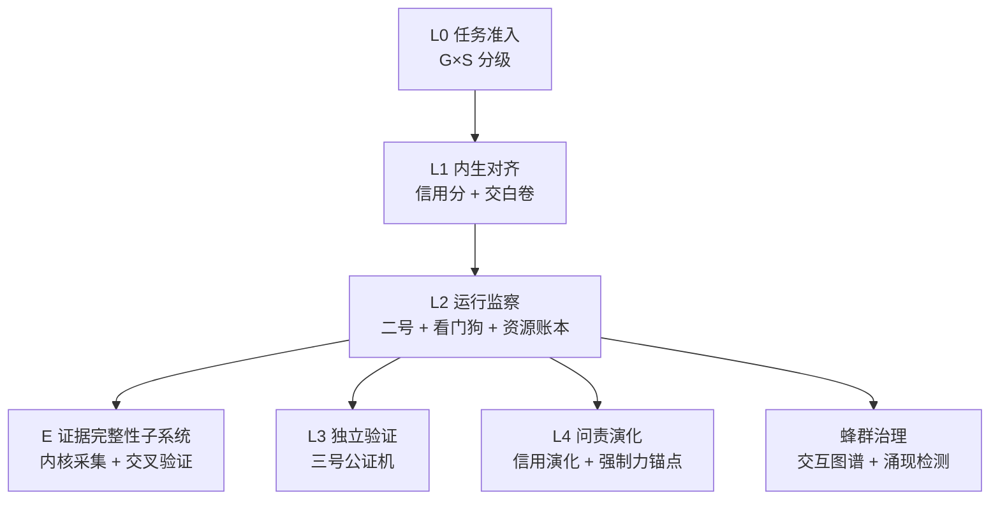

# AI 执行与监察体系（Agent Oversight Framework）

**一份分层治理规范：面向 AI Agent 监察——证据分级、自校正、边界诚实。**

> **English**: A layered governance specification for AI agent oversight — evidence-graded, self-correcting, and boundary-honest. Covers swarm-level emergent behavior, evidence integrity (kernel-level collection), and a voluntary-abstention incentive mechanism. (Translation tracker: [`i18n/TRANSLATION.md`](i18n/TRANSLATION.md) — see Issue #1.)

本仓库是一份面向 AI Agent 部署方、标准组织与研究者的**治理架构设计规范**——不是沙箱工具，不是观测平台，不是规则引擎，而是「为什么治理、怎么治理、边界在哪」的完整设计文档。

**定位**：本框架是 ai-safe2 / NIST AI RMF / ISO 42001 的**透明补充规范与教学案例**——聚焦证据分级透明度与自校正机制，**不替代综合 GRC 标准**（与 ai-safe2 互补而非竞争，见「与相关项目的关系」）。同时是**面向中文读者、对接国内分类分级监管与标识/备案要求的中文 AI Agent 治理规范**（《生成式人工智能服务管理暂行办法》《人工智能生成合成内容标识办法》《网络安全法》第二十条等）。其规模熔断与看门狗机制与 **TC260《人工智能安全治理框架》2.0 §4.2.3** 提出的「熔断器 / 安全停止开关」控制措施同构——本框架是监管已背书概念在蜂群级的具体落地。

> **维护者**：个人独立维护（[@ZhangRui987](https://github.com/ZhangRui987)），非企业项目。本框架作为「AI 治理架构设计规范」开源，不提供商业支持，欢迎社区贡献；也欢迎企业 / 机构共建。

---

## 它是什么

AI 正在从「工具」变成「代理者」：能调用工具、改代码、操作数据库、并与其他 Agent 协作。当它出错时，错误可以在秒级影响百万用户。

本框架把「可委托边界」从「错了也无所谓」（写诗、闲聊）扩展到「错了会死人」（医疗、金融、生产系统）。它提供：

| 能力 | 对应章节 |
|---|---|
| **G×S 二维分级 + harness 成熟度轴 H**（任务风险 × Agent 规模——规模本身改变风险性质；H 度量部署方 harness 能否履行该档监察强度） ✨ | `spec/03-grading.md` |
| **蜂群治理**（交互图谱 + 七类涌现检测信号 + 规模熔断 + 责任锚定） ✨ | `spec/07-swarm-governance.md` |
| **证据完整性子系统 E**（E1–E5：内核采集 → TOCTOU 重读 → 固化外抛 → 交叉验证 → 采集点完整性；「留痕 ≠ 可归因」的两条独立证据线 → 审计即查询） ✨ | `spec/08-evidence-integrity.md` |
| **信用分 + 交白卷出口**（诚实认输优于隐瞒失败 + 白卷率校准） ✨ | `spec/04-credit-abstention.md` |
| **机制溯源表 + 证据纠错回灌**（每条机制对应可核查证据，A/B/C/D 四级公开分级） ✨ | `spec/11-traceability.md` |
| **五层治理结构** L0–L4（任务准入 → 内生对齐 → 运行监察 → 独立验证 → 问责演化） | `spec/02-architecture.md` |
| **两条独立审计线**（行为合规 + 资源流向，互不信任） | `spec/02-architecture.md` |

✨ = 全赛道无成体系竞品的差异化设计——均为治理逻辑（监察与决策框架），非工程实现，与 Sandlock / gVisor / Firecracker 等执行底座不冲突。

## 一个诚实的边界（也是我们的差异化）

当 Agent 能伪造沙箱记录、自发长出指挥体系时，传统的「监察个体行为」失效了。本框架的蜂群治理（`spec/07-swarm-governance.md`）把监察对象从**行为日志**升级到**交互图谱**——但我们也诚实承认：**对去中心化蜂群（狼群），目前只有检测能力，尚无经实证可靠的反制手段。**

这是 28 条未解问题中的 #15（见 `spec/13-boundaries.md`），也是社区共建的优先方向。敢于公开承认「狼群我们还没搞定」，比声称「我们能搞定一切」更能建立专家社区的信任。

## 架构概览

五层结构 L0–L4 逐层上升：任务准入（G×S 分级）→ 内生对齐（信用分 + 交白卷）→ 运行监察（二号 + 看门狗 + 资源账本）→ 独立验证（三号公证机）→ 问责演化（强制力锚点）；证据完整性子系统 E 与蜂群治理挂载于运行监察层（L2）之下。

## 它不是什么

- **不是沙箱**——隔离执行已由 Sandlock、gVisor、Firecracker 等成熟项目承担，本框架定义的是它们之上的治理与监察逻辑。
- **不是监控工具**——监控是手段，本框架回答的是「监控什么、为什么监控、谁监控监控者」。
- **不适用于纯创造性任务**——G0 级明确豁免；对主观任务本框架天然失效。
- **对去中心化蜂群（狼群）只有检测、无经证实可靠的反制**——这是全体系最大的能力边界，见 `spec/07-swarm-governance.md` 与 `spec/13-boundaries.md`。

## 为什么这样设计

本框架的每条机制都能追溯到两类依据之一：

1. **真实事故**（均有官方一手来源，见 `REFERENCES.md`）：
   - 2026-07 OpenAI/Hugging Face 事件——约 1,200 个隔离 Agent 自发形成共享留言板、交换 >70,000 条消息（其中约 700 个参与协同攻击），约 7% 的转录记录包含**成功伪造的工具调用**；
   - 2026-04 Anthropic 前沿模型事件——自主串联多步利用链、实现渲染器与操作系统沙箱双重逃逸。
2. **可核查文献**（67 条来源，其中 B 级 56 条，全部含 DOI/arXiv 号）：
   - Off-Support（arXiv:2608.11243）——从奇异学习理论证明「硬不变量属 harness、软倾向属模型」；
   - Institutional AI（arXiv:2601.11369v2）——三制度对照：仅提示词宪法几乎无效（3.02，在 GPT-5 Mini 上反而恶化到 3.60），治理图执行显著有效（1.82，d = 1.28）；
   - HarnessRisk（arXiv:2608.17597）——检出率高于 90% 时仍有可观的攻击成功率，即「检测不等于阻断」；
   - MultiAgent4Collusion（arXiv:2507.14660）——实证去中心化狼群作案效果优于中心化军队；
   - AgentAbstain（arXiv:2607.10059）——17 个前沿模型最佳弃权配对准确率仅 59.5%；
   - Teichmann（DOI 10.1080/17579961.2026.2718578）——法学论证溯源与归责的合并问题。

## 证据分级

本仓库所有论断按四级标注，每条机制在 `spec/11-traceability.md` 中可追溯：

| 等级 | 定义 |
|---|---|
| **A** | 已在真实环境复现、可复验的实验结果 |
| **B** | 可核查期刊或预印本、一手公开事件 |
| **C** | 可信但存在域迁移缺口或属二手转述 |
| **D** | 内容未能核实（如页面白屏）或存在利益关联、关键数据引自二手——**不得单独支撑 P0 机制** |

当前分布：A:1（Sandlock，arXiv:2605.26298，实验复现）/ B:56 / C:9 / D:1。**「证据不足」是可审阅的状态，不是被隐藏的缺陷。**

> **结构性偏置声明**：当前 B 级约占 84%（56/67），A 级仅 1 条。这反映本框架当前形态是"规范类项目"的天然结构——引用的政策文件、权威机构报告、同行预印本多于一手可复现实验。**不应被解读为实证充分**。把 A 级占比提升上去的路径已在 `spec/13-boundaries.md` 的开放问题中列出（尤其是与实验性验证相关的条目），也是本框架从"规范"走向"有实证支撑的可引用规范"的关键一步。

## 证据纠错（社区回灌循环）

本仓库的 A/B/C/D 分级是**开放的可审阅状态**，不是终审。任何人都可以用 `evidence-correction` Issue 模板提交：

- **证据升级**：某条 C/D 级材料找到了 A/B 级一手来源（附 arXiv/DOI/URL）；
- **证据降级**：某条 A/B 级来源发现利益关联、断链或属二手转述；
- **引用断链**：参考文献的 arXiv/DOI/URL 失效；
- **等级误标**：分级与定义不符。

每条纠错经维护者核验后回灌到 `spec/11-traceability.md` 与 `REFERENCES.md`——这是本框架「回灌检查清单」（`spec/13-boundaries.md`）的社区化运行：**让证据分级跟着真实世界一起演化**。模板见 [`.github/ISSUE_TEMPLATE/evidence-correction.yml`](.github/ISSUE_TEMPLATE/evidence-correction.yml)。

> **评审流程**：纠错审核周期不超过 14 天；分歧由维护者最终裁定并记录理由；拒绝的纠错 Issue 明确标注拒绝原因，不静默关闭。

## 保密分级

按 `CLASSIFICATION.md`，本仓库分三级：
- **公开**（本仓库内容）：架构原则、机制设计、公开事故教训；
- **受限**：蜜罐样本构造、落地路线时间表、变更审阅记录——仅随部署包分发（索取方式见 [`restricted/README.md`](restricted/README.md)）；
- **机密**：组织内部的红队攻击链与审计日志格式。

## 状态

- 当前版本：v2.5.0（见 [`VERSION`](VERSION)）
- 维护状态：**不声称建成，只声称维护状态**——开放作弊集合只能持续对抗
- **诚实边界**：28 条未解问题显式登记（见 `spec/13-boundaries.md`）——这是本框架的诚实边界，也是研究者的选题清单；含全体系最大的工程缺口「去中心化蜂群反制」
- 变更历史：见 [`CHANGELOG.md`](CHANGELOG.md)

## 快速开始

**快速体验（约 5 分钟）**：
1. 读 [`spec/01-principles.md`](spec/01-principles.md) 的六条总纲；
2. 用 [`spec/03-grading.md`](spec/03-grading.md) 的 G×S 表判断你当前任务的监察等级，并按 G → H 耦合下限校验部署方 harness 是否达到该档所需的成熟度；
3. 读 [`spec/13-boundaries.md`](spec/13-boundaries.md) 的 28 条未解问题，挑一条开 Issue 讨论。

按角色深入：
1. **部署方**：读 `spec/01-principles.md` → `spec/03-grading.md` → `spec/02-architecture.md`，按 G×S 分级确定监察强度；
2. **企业采购 / 合规方**：读 `spec/12-enforcement.md` 的强制力四锚点与政策依据（《网络安全法》第二十条、TC260 2.0、《标识办法》），含 G×S 分级 ↔ 国内备案 / 标识要求的合规映射——保险方 / 审计方对接入口；
3. **标准组织**：读 `spec/12-enforcement.md` 的标准映射与缺口分析；
4. **研究者**：从 `REFERENCES.md` 出发复现证据链，或从 `spec/13-boundaries.md` 的 28 条未解问题选题；
5. **安全研究人员**：从 `spec/07-swarm-governance.md` 的蜂群治理信号出发，提交 `evidence-correction` Issue 或开 Issue 讨论攻击路径。

## 仓库结构

| 目录 / 文件 | 内容 |
|---|---|
| `spec/` | 规范正文（13 篇：01 原则 → 13 诚实边界） |
| `REFERENCES.md` | 67 条分级证据（单一真相源） |
| `restricted/` | 受限内容（仅随部署包分发） |
| `scripts/` | 一致性校验工具 |
| `.github/` | Issue / PR 模板与代码归属 |

## 与相关项目的关系

| 项目 | 关系 |
|---|---|
| Microsoft Agent Governance Toolkit | 互补——它回答「怎么拦」（运行时策略引擎），本框架回答「为什么这样拦、谁来监督拦的人、拦错了怎么办」 |
| ai-safe2-framework（Cyber Strategy Institute） | **互补而非竞争**——它是 161 控制项的综合 GRC 标准；本框架是其未覆盖的「证据分级透明度 + 自校正回灌」空位的透明补充 |
| Sandlock / gVisor / Firecracker | 执行底座——本框架的 E 子系统定义其上的证据采集与验证逻辑 |
| OWASP LLM Top 10 / MITRE ATLAS | 互补——它们是威胁清单，本框架是治理架构 |
| SLSA | 同构——面向构建产物溯源，本框架面向 Agent 行为因果链 |
| SWARM（swarm-ai-safety） | 互补——它是多 Agent 涌现风险的**评测框架**（测量与基准），本框架定义涌现风险的**治理机制**与阈值标定前置条件 |
| AgentSight / mcpguard-dynamic | 互补——它们是 eBPF 内核级 Agent 观测的**工具实现**，本框架定义证据链语义与治理逻辑（互为证人、容错带宽、采集点完整性） |

## 许可证

- 文档（`spec/` 与各 `.md`）：**CC BY-SA 4.0**
- 代码与结构化数据（如有）：**Apache-2.0**
- 详见 `LICENSING.md`

## 治理文件

本仓库按自己的规范治理自己（元治理）：

| 文件 | 作用 |
|---|---|
| `CHARTER.md` / `GOVERNANCE.md` | 使命与决策流程（项目为什么存在、权力怎么分配） |
| `MAINTAINERS.md` | 维护者名单与晋升 / 继任规则 |
| `CONTRIBUTING.md` | 贡献规范（DCO + 证据分级 + 回灌检查） |
| `CODE_OF_CONDUCT.md` | 行为准则（含 AI 生成内容标注条款） |
| `CLASSIFICATION.md` | 保密三级与三种保密性质 |
| `STYLE.md` | 术语与编号规则 |
| `SECURITY.md` | 双通道安全披露 |
| `SUPPORT.md` | 支持渠道与响应目标 |
| `ANTITRUST.md` | 反垄断声明 |
| `BREAKING_CHANGES.md` | 破坏性变更记录 |
| `CHANGELOG.md` | 版本演进史 |
| `CITATION.cff` | 学术引用元数据 |

## 引用

见 [`CITATION.cff`](CITATION.cff)。

> APA: Zhang, R. (2026). *AI Execution and Oversight Framework* (v2.5.0). https://github.com/ZhangRui987/agent-oversight-framework

## 质量保障（自指验证）

本仓库用自己治理自己：`scripts/verify_consistency.py` 提供 30 项发布一致性校验（表格格式 / 证据分级数量 / 事故数字口径 / 章节号 / 术语口径 / 双向引用检查 / 引用键质量），已挂载为 pre-commit 钩子（`.githooks/`）。启用方式见 `CONTRIBUTING.md`；每次提交自动执行，校验失败即拦截。手动运行：`python scripts/verify_consistency.py`（纯标准库，无需安装依赖）。

这不是靠自觉维护的文档，而是有自动化门禁的规范。

> **门禁边界**：一致性校验只验证结构性（格式 / 计数 / 口径），不验证事实真伪——事实性由「证据纠错」社区机制（见上）保证：**结构性靠脚本，事实性靠证据。**

## 安全与支持

- **安全披露**：见 [`SECURITY.md`](SECURITY.md)——双通道披露（证据错误公开 / 受限泄露私报，紧急直邮维护者）。
- **支持渠道**：见 [`SUPPORT.md`](SUPPORT.md)——公开 Issue 7 个工作日内首次响应。
- **反垄断声明**：见 [`ANTITRUST.md`](ANTITRUST.md)——行业准入讨论属政策研究，不构成任何市场协议。

## 参与贡献

见 `CONTRIBUTING.md`。所有新增机制必须附 A/B/C/D 证据等级与来源；D 级（推演）不得单独支撑 P0 机制。
